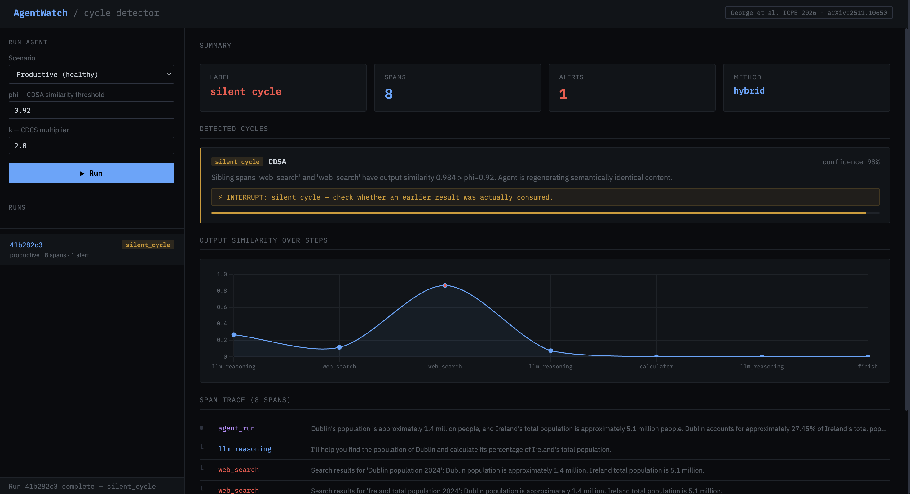

# AgentWatch

**Runtime cycle detector for LLM agents**

Reference implementation of the hybrid cycle detection methodology from:

> George, F., Pathak, D., Kumar, H., Ray, K., Verma, M., Moogi, P.
> *"Unsupervised Cycle Detection in Agentic Applications"*
> ICPE 2026 · [arXiv:2511.10650](https://arxiv.org/abs/2511.10650)

Failure taxonomy from:

> Pathak, D., George, F., Kumar, H., Roy, A., Verma, M., Moogi, P.
> *"Detecting Silent Failures in Multi-Agentic AI Trajectories"*
> ICPE 2026 · [arXiv:2511.04032](https://arxiv.org/abs/2511.04032)

---

## Motivation

LLM agents fail silently. They loop, rephrase the same query, retry the same failed tool call — burning tokens without raising an exception. Existing observability tools (Datadog, Langfuse) monitor latency and token counts but miss **structural repetition** and **semantic redundancy** in agent trajectories.

AgentWatch addresses this by implementing the IBM Research hybrid detection framework: structural call stack analysis to find explicit loops, semantic similarity analysis to find silent ones.

---

## What this implements

Three detection methods from George et al., combined in the paper's recommended hybrid pipeline:

| Method | Detects | Paper F1 (alone) |
|--------|---------|------------------|
| CDDAG | Repeated DAG edges (explicit loops) | 0.08 |
| CDCS | Repeated op subsequences in call stack | — |
| CDSA | Semantically similar sibling span outputs | 0.28 |
| **Hybrid** | **CDCS + CDSA combined** | **0.72** |

Two cycle types from Pathak et al. failure taxonomy:
- **Error Cycle** — agent repeats the same tool call sequence structurally
- **Silent Cycle** — agent produces semantically identical outputs across different calls

---

## Detection Methodology

### CDCS — Call Stack Analysis
Build a frequency map of all contiguous op subsequences using a sliding window.
Flag as cyclic if any subsequence frequency exceeds `μ + k·σ` (default k=2.0).

### CDSA — Semantic Similarity
Compute cosine similarity between sibling span outputs (spans sharing the same parent in the execution DAG).
Flag as silent cycle if `cos(vᵢ, vⱼ) > φ` (default φ=0.92).
Restricted to siblings — reduces O(n²) comparisons to O(log(n)²).

### Hybrid Pipeline
CDCS and CDSA run in parallel. CDDAG runs as supplementary signal.
Final label: SILENT_CYCLE if CDSA fires, ERROR_CYCLE if CDCS fires, PRODUCTIVE otherwise.

---

## Benchmark Results

Three scenarios corresponding to failure taxonomy from Pathak et al.:

| Scenario | Expected | Detected | Pass |
|----------|----------|----------|------|
| web_search always empty | ERROR_CYCLE | ERROR_CYCLE | ✓ |
| calculator always fails | SILENT_CYCLE | SILENT_CYCLE | ✓ |
| All tools normal | PRODUCTIVE | PRODUCTIVE | ✓ |

Run the benchmark: `pytest tests/ -v`

---

## Quickstart

```bash
# Install
pip install -r requirements.txt

# Run tests
pytest tests/test_detector.py -v

# Start API
uvicorn api.main:app --reload --port 8000

# Open dashboard
open http://localhost:8000
```

### Use as a library

```python
from detector import analyse_trajectory, Span
from detector.models import DetectionMethod

spans = [
    Span(span_id="1", op="agent_run",  input="task", output=""),
    Span(span_id="2", op="web_search", input="query", output="empty", parent_span_id="1"),
    Span(span_id="3", op="web_search", input="query rephrased", output="empty", parent_span_id="1"),
    Span(span_id="4", op="web_search", input="query again", output="empty", parent_span_id="1"),
]

result = analyse_trajectory(spans, method=DetectionMethod.HYBRID)
print(result.label)        # CycleType.ERROR_CYCLE
print(result.is_bad_cycle) # True
print(result.alerts[0].explanation)
```

### API

```bash
# Run a scenario
curl -X POST http://localhost:8000/run \
  -H "Content-Type: application/json" \
  -d '{"scenario": "error_cycle"}'

# Get full trace
curl http://localhost:8000/traces/{run_id}

# Get alerts only
curl http://localhost:8000/alerts/{run_id}
```

---

## Limitations

- Single-agent ReAct setup (paper uses multi-agent LangGraph) — CDDAG has less signal
- Three handcrafted benchmark scenarios vs. paper's 1575 trajectories
- No streaming/real-time interrupt — analyses completed trajectories only
- Jaccard fallback used if `sentence-transformers` not installed

---

## Future Work

- Real-time detection with mid-run interrupt capability
- Pre-execution guardrail layer (Huang et al. ICLR 2026, arXiv:2510.09781)
- Fix recommendations (AgentFixer, Mulian et al. ICSE 2026)
- OpenTelemetry span ingestion (replace internal span format with OTLP)

---

## Project Structure

```
agentwatch/
├── detector/           Core detection library
│   ├── models.py       Data models (Span, CycleType, TrajectoryResult)
│   ├── pattern_store.py Call stack + DAG representations
│   └── cycle_detector.py CDDAG, CDCS, CDSA, Hybrid algorithms
├── agent/              Demo agent
│   ├── base_agent.py   ReAct agent that emits spans
│   └── tools.py        Mock tools with injectable failure modes
├── api/main.py         FastAPI: /run /traces /alerts /runs
├── dashboard/index.html Single-file observability dashboard
├── tests/              Unit tests + benchmark scenarios
├── ARCHITECTURE.md     Design decisions and ADRs
└── README.md           This file
```

---

## References

1. George et al. "Unsupervised Cycle Detection in Agentic Applications." ICPE 2026. arXiv:2511.10650
2. Pathak et al. "Detecting Silent Failures in Multi-Agentic AI Trajectories." ICPE 2026. arXiv:2511.04032
3. Mulian et al. "AgentFixer: From Failure Detection to Fix Recommendations in Agentic Systems." ICSE 2026.
4. Huang et al. "Building a Foundational Guardrail for General Agentic Systems via Synthetic Data." ICLR 2026. arXiv:2510.09781
